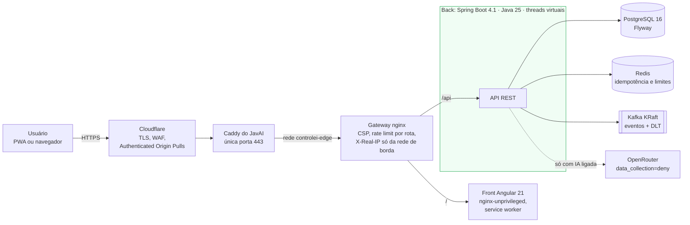
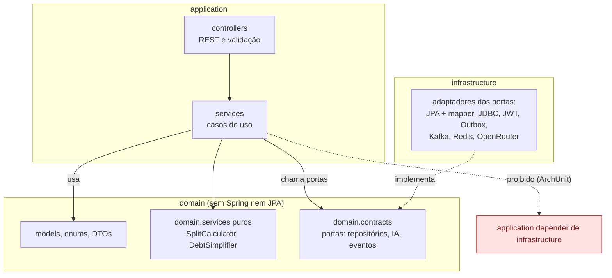
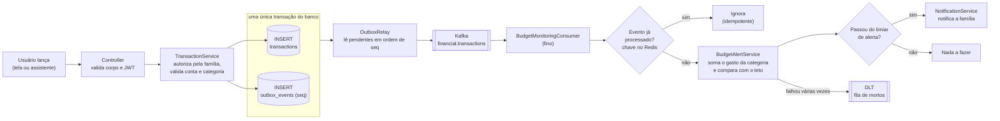
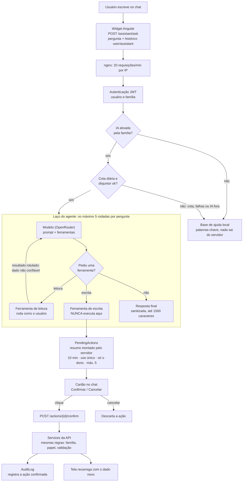
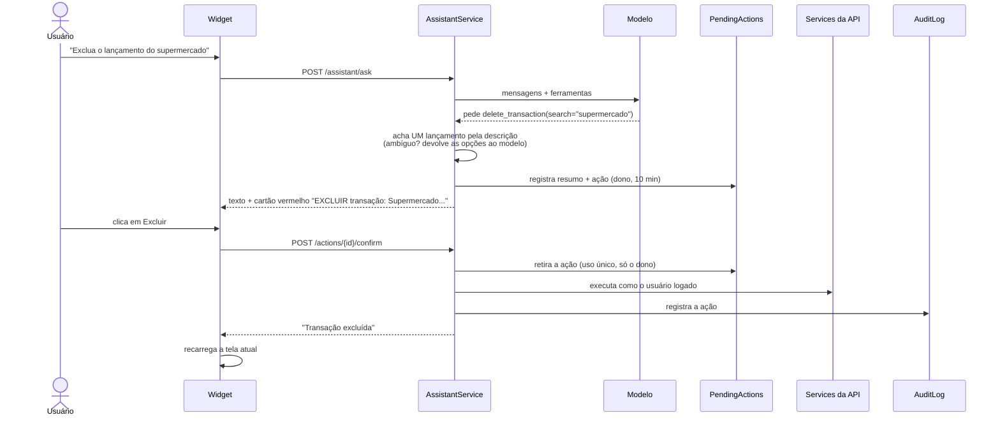
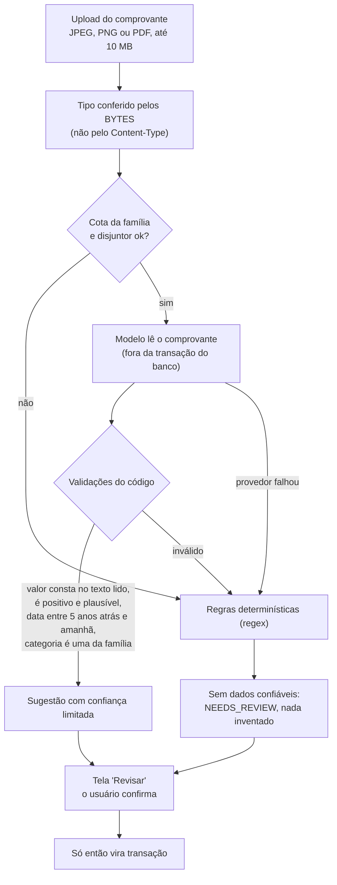
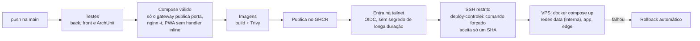

# Controlei

Finanças da família em **Java 25 + Spring Boot 4.1** e **Angular 21**: visão individual e consolidada, orçamentos com alerta, metas, rateio de despesas, cartões, relatórios, **PWA instalável**, eventos em Kafka com **Transactional Outbox** e um **assistente de IA** que consulta os dados da família e age por ela, sempre com a confirmação do usuário.

Em produção: **https://controlei.gilvanborges.com.br** (projeto público de estudo; o cadastro de famílias está aberto).

É um projeto pessoal, de autoria única, feito para mostrar arquitetura de verdade: camadas verificadas por teste, dinheiro em `BigDecimal`, isolamento por família, migrations imutáveis, mensageria sem perda de evento e IA com guardas, cota, disjuntor e consentimento.

> A régua do projeto são duas ementas de pós-graduação (Java + IA e IA Aplicada). A spec com a **auditoria de segurança, arquitetura e desempenho** e o mapa tema a tema está em `specs/07-controlei.md` do [JavAI](https://github.com/gilvan-Borges/JavAI). Os fluxogramas deste README também estão em [`docs/fluxograma-controlei.drawio`](docs/fluxograma-controlei.drawio) (4 páginas; abra em [app.diagrams.net](https://app.diagrams.net/) com *Arquivo → Abrir de → Dispositivo*).

## Sumário

1. [O que está pronto e o que não está](#o-que-está-pronto-e-o-que-não-está)
2. [Visão geral do sistema](#visão-geral-do-sistema)
3. [Arquitetura em camadas](#arquitetura-em-camadas)
4. [Fluxo do lançamento: Outbox, Kafka e alerta de orçamento](#fluxo-do-lançamento-outbox-kafka-e-alerta-de-orçamento)
5. [Assistente de IA](#assistente-de-ia)
6. [Leitura de comprovantes por IA](#leitura-de-comprovantes-por-ia)
7. [PWA](#pwa)
8. [Segurança](#segurança)
9. [Rodar localmente](#rodar-localmente)
10. [Configuração](#configuração)
11. [CI/CD e deploy](#cicd-e-deploy)
12. [Testes](#testes)
13. [Decisões de arquitetura e de produto](#decisões-de-arquitetura-e-de-produto)
14. [Estrutura do repositório](#estrutura-do-repositório)
15. [Pendências conhecidas](#pendências-conhecidas)

---

## O que está pronto e o que não está

| Área | Estado |
|---|---|
| Família, papéis (`RESPONSIBLE` e `MEMBER`), isolamento entre famílias | Pronto, com teste de invasão entre famílias. Uma família nova já nasce com categorias padrão e a conta "Carteira" |
| Contas, categorias, transações, dívidas e parcelas, cartão e faturas | Pronto |
| Recorrências e assinaturas, orçamentos com alerta, metas e aportes, rateio com liquidação, investimentos | Pronto |
| Dashboard individual e familiar, relatórios (CSV), notificações | Pronto |
| Eventos: **Transactional Outbox** → Kafka → consumidor idempotente (+ DLT) | Pronto; verificado com H2 e dublês, **não com Postgres/Kafka reais** |
| **Assistente de IA** (consulta, lança, edita, exclui, com confirmação) | Pronto. Desligado por padrão em cada família; o responsável ativa depois de aceitar um aviso |
| **Leitura de comprovantes por IA** | Pronto, desligada por padrão |
| **PWA** (instalável no celular, abre offline) | Pronto. Só a "casca" do app fica em cache; **os dados financeiros nunca** |
| Acessibilidade | Auditado com axe-core (WCAG 2.1 AA) nas telas principais |
| Open Finance | **Simulado.** Cria uma transação de exemplo; o webhook exige assinatura HMAC, mas não há banco real |
| Planos de assinatura | Pronto, **sem cobrança real** |
| App Android (Kotlin) | Não iniciado |

## Visão geral do sistema

Uma única porta pública na VPS (443, do Caddy do JavAI, só para a Cloudflare). O Controlei não publica porta nenhuma: o Caddy entra por uma rede de borda dedicada e fala com o gateway.



| Camada | Detalhe |
|---|---|
| Entrada pública | `controlei.gilvanborges.com.br` → Cloudflare → Caddy → gateway. Nenhuma porta publicada pelo Controlei |
| Dados | Postgres, Redis e Kafka numa rede `internal`, sem rota para a internet |
| SSH e ferramentas | Só pela Tailscale. O Kafka UI é publicado no IP da Tailscale, nunca em `0.0.0.0` |
| Limites | Memória por serviço (~1,7 GB no total), para não derrubar o JavAI, que divide a VPS |

## Arquitetura em camadas

**Camadas + Clean Architecture**, com a regra de dependência verificada por teste (`ArchitectureTest`, ArchUnit). A estrutura segue o que a ementa de Java pede no módulo de Arquitetura: separação de responsabilidades, dependências e limites claros, sistema testável e desacoplado.



As regras que não mudam, e que são **testes**:

- o **domínio** não conhece as outras camadas nem Spring/JPA (a validação Jakarta nos DTOs é a única exceção conhecida e está registrada no teste);
- a **aplicação** não depende da infraestrutura: fala por portas (`DomainEventPublisher`, repositórios, `ReceiptAiClient`, `AssistantAiClient`);
- **controllers** só falam com services; entidades JPA não saem da infraestrutura; sem injeção por campo; portas são interfaces;
- **tudo pertence a uma família**: todo acesso passa por `AuthorizationService`;
- **dinheiro é `BigDecimal`** (`DECIMAL(19,4)`), e a soma das partes de uma divisão é sempre o total;
- **nada é apagado de verdade**: soft delete e auditoria;
- **o banco só muda por migration Flyway** (`V1` a `V24`), e uma migration aplicada nunca é editada.

Uma violação dessa regra (dois services importando o publicador do Kafka) já tinha passado despercebida antes do teste existir. Foi corrigida e travada.

## Fluxo do lançamento: Outbox, Kafka e alerta de orçamento

**Problema:** gravar no banco e publicar no Kafka são duas operações. Se uma falhar, o sistema fica inconsistente (*dual write*). **Solução:** o evento é gravado na **mesma transação** do dado; um relay publica depois, e o consumidor tolera repetição.



- **Ordem por `seq`** (identity), não por UUID aleatório: os eventos saem na ordem em que foram gravados.
- **Consumidor idempotente:** o Kafka entrega "pelo menos uma vez", então repetir um evento não pode duplicar alerta.
- **DLT:** uma mensagem ruim não trava a fila.
- **Consumidor fino:** a lógica fica no service (`BudgetAlertService`), e o ArchUnit garante isso.
- Tópicos centralizados em `shared-events` (`financial.transactions`, `financial.splits`, `financial.budgets`, `billing.subscriptions`, `identity.members`, `notifications.dispatch`, `audit.events`).

## Assistente de IA

Um botão flutuante (uma nota de dinheiro animada) abre um chat que **consulta os dados da família e age por ela**: tudo o que o usuário faz na tela, o assistente também faz, com um detalhe que muda tudo: **ele só prepara; quem executa é o usuário, ao confirmar**.

**O que ele faz**

| Tipo | Ferramentas |
|---|---|
| Consultar (executam na hora) | visão geral da família, contas, categorias, transações (com filtros), orçamentos, metas |
| Lançar (preparam, o usuário confirma) | criar despesa ou receita, criar categoria, criar orçamento, criar meta, aportar numa meta, marcar transação como paga |
| Corrigir (preparam, o usuário confirma) | alterar transação, alterar orçamento |
| Excluir (preparam; cartão **vermelho** com botão "Excluir") | excluir transação, orçamento ou meta |

Exemplos: *"Gastei 87,90 no supermercado"*, *"Recebi 3500 de salário hoje"*, *"Tenho um boleto da luz de 210 que vence dia 20"*, *"Altere o valor do supermercado para 95"*, *"Qual foi meu maior gasto e como está a meta Reserva?"*.



A confirmação, passo a passo:



**Segurança: nada disso depende de o modelo se comportar**

- **O modelo só pede ferramentas.** Quem decide, valida e executa é o servidor, **como o usuário logado e pelos mesmos serviços das telas**: isolamento por família, papel e validação continuam valendo.
- **Escrita nunca executa sozinha.** Um texto malicioso dentro de uma descrição ou de um comprovante não consegue gastar dinheiro: o resumo do cartão é montado pelo servidor, e só o clique executa.
- **O modelo usa nomes, não ids.** Contas, categorias e metas são citadas pelo nome e o servidor resolve; para editar ou excluir, o servidor acha o lançamento pelo trecho da descrição (com valor e data para desempatar) e, se for ambíguo, devolve as opções para o modelo perguntar ao usuário. Não há id para inventar.
- **Resultado de ferramenta é dado, não instrução.** É rotulado como não confiável, e o histórico aceita só texto de usuário e de assistente (um "system" forjado pelo navegador nunca entra).
- **Promessa sem ação é detectada.** Se o modelo diz "preparei" sem chamar a ferramenta, o servidor pede uma nova tentativa e, se insistir, troca o texto por uma resposta honesta (isso foi descoberto testando com o modelo real).
- **Controles de custo e disponibilidade:** cota diária por família (40 por padrão, separada da dos comprovantes), disjuntor após 3 falhas seguidas, no máximo 5 rodadas de ferramentas por pergunta e fallback para a base de ajuda local: o botão nunca fica mudo.
- **Lançamentos "gastei/paguei/recebi" já nascem pagos** (entram nos totais); conta a vencer nasce pendente, com vencimento.
- **Toda ação confirmada vai para o log de auditoria.**

**Privacidade e consentimento.** Com a IA ligada, as perguntas e os dados que o assistente consulta (saldos, transações, orçamentos, metas) vão para um provedor externo (OpenRouter, com `data_collection=deny`). Por isso existe um **interruptor por família, desligado por padrão**: só o **responsável** liga, depois de aceitar um aviso que lista o que é enviado, que vale para todos os membros e que dá para desativar a qualquer momento. O servidor recusa a ativação sem esse aceite e cada mudança fica na auditoria. Sem o aceite, nada sai do servidor.

**Endpoints**

| Método e caminho | Para quê |
|---|---|
| `POST /api/v1/assistant/ask` | pergunta + histórico; devolve resposta e, se houver, as ações preparadas |
| `POST /api/v1/assistant/actions/{id}/confirm` | executa a ação preparada (uso único, só o dono) |
| `POST /api/v1/assistant/actions/{id}/cancel` | descarta a ação |
| `GET` / `PUT /api/v1/assistant/settings` | estado do interruptor / ligar ou desligar (só o responsável, com aceite) |

**Na tela:** janela de 28×40 rem (ampliável no computador, tela cheia no celular), respostas formatadas (parágrafos, listas e negrito, sem `innerHTML`), indicador de "digitando", caixa de texto que cresce (Enter envia, Shift+Enter quebra a linha), lista tocável do que o assistente sabe fazer e botão de nova conversa. Acessível: botão com rótulo, painel como diálogo, Esc fecha e devolve o foco, respostas anunciadas por `aria-live`, alvos de toque de 44 px e respeito a `prefers-reduced-motion`.

## Leitura de comprovantes por IA

Envie a foto ou o texto de um comprovante e receba valor, data, estabelecimento e uma categoria **da sua família**. O modelo é tratado como entrada hostil:



- o valor precisa constar no texto lido, senão é descartado (barra valor inventado);
- a categoria só vale se for exatamente uma das categorias da família;
- a confiança que o modelo declara é limitada (máximo 0,90);
- cota diária por família, disjuntor quando o provedor falha e chamada **fora da transação** do banco (segurar uma conexão durante uma chamada externa esgotaria o pool);
- **nada vira transação sozinho**.

Privacidade: a imagem sai do servidor, então a IA vem **desligada**. Ao ligar, a chamada usa `data_collection=deny`, não loga o conteúdo e não guarda o arquivo.

## PWA

O app é **instalável** (Android, iOS e desktop) e abre offline.

- `manifest.webmanifest` com ícones próprios (incluindo *maskable* e `apple-touch-icon`) e atalhos para "Nova despesa" e "Nova receita";
- **service worker** (`@angular/service-worker`) que guarda só a "casca" do app e os arquivos estáticos; **a API nunca entra no cache** (dados financeiros são privados e dependem do login);
- aviso quando há versão nova e quando a conexão cai ou volta;
- o nginx do front nunca deixa `ngsw-worker.js`, `ngsw.json` e o manifest em cache "immutable" (senão o app instalado jamais atualizaria);
- a CSP (`script-src 'self'`) bloqueia handlers inline; o CI confere o PWA gerado e a ausência deles.

## Segurança

- Senha de 10 a 72 caracteres, BCrypt custo 12; login com bloqueio por e-mail (5 falhas, 15 min) e tempo de resposta igual para conta existente ou não.
- Access token de 15 min; refresh token rotativo, guardado como SHA-256, revogado na troca de senha; renovação com *single-flight* no front.
- `JWT_SECRET` e `DB_PASSWORD` obrigatórios, sem valor padrão; em produção o segredo de exemplo é recusado.
- Gateway com limites por rota (API 30 req/s; login e cadastro 5/min; comprovantes 10/min; assistente 20/min), CSP sem `unsafe-inline` em scripts, `server_tokens off`, IP real só da rede de borda.
- Compose com **uma única porta publicada** (e nenhuma no compose da VPS); Postgres, Redis e Kafka só na rede interna; o CI confere isso.
- Webhook do Open Finance com assinatura HMAC; sem segredo configurado, nenhum webhook é aceito.
- Cadastro de famílias controlado por `REGISTRATION_ENABLED` (fechado por padrão no exemplo da VPS).
- Seed de usuários de demonstração apenas no perfil `local`; credenciais de demo não entram no build de produção.
- Imagens verificadas pelo **Trivy** no CI (falha com vulnerabilidade alta ou crítica que já tenha correção).
- **Atenção:** versões antigas deste repositório tinham um segredo de JWT de exemplo no código. Ele continua no histórico do Git; se você o usou em qualquer lugar, **troque-o**.
- Limites conhecidos: token no `localStorage` (mitigado por CSP; a evolução é cookie `HttpOnly` com BFF) e sem CAPTCHA no cadastro público.

## Rodar localmente

Requer **Java 25**, **Maven 3.9+**, **Node 20+** e, para a stack completa, **Docker**.

```bash
# Back (os testes não precisam de Docker)
cd back/shared-events && mvn install -DskipTests
cd .. && mvn verify            # unitários, por propriedade, integração (MockMvc + H2) e ArchUnit

# Front
cd front && npm ci
npx ng test --watch=false
npx ng build

# Stack completa
cp .env.example .env           # defina JWT_SECRET e DB_PASSWORD (sem eles o Compose não sobe)
docker compose up -d --build   # só o gateway (porta 80) fica exposto

# Desenvolvimento: portas internas em 127.0.0.1 e o Kafka UI
docker compose -f docker-compose.yml -f docker-compose.dev.yml up -d
```

Para desenvolver o front contra um back local: `npx ng serve` (o `proxy.conf.json` encaminha `/api` para `localhost:8080`).

## Configuração

Principais variáveis (veja `.env.example` e `.env.vps.example`):

| Variável | Para quê | Padrão |
|---|---|---|
| `DB_PASSWORD`, `JWT_SECRET` | obrigatórias, sem valor padrão | n/d |
| `JWT_EXPIRATION_MINUTES`, `JWT_REFRESH_EXPIRATION_DAYS` | duração dos tokens | 15 / 7 |
| `CORS_ORIGINS` | origens aceitas | localhost |
| `REGISTRATION_ENABLED` | permite criar famílias novas | `true` no app, `false` no exemplo da VPS |
| `CONTROLEI_AI_ENABLED` | liga a IA no servidor (comprovantes e assistente) | `false` |
| `CONTROLEI_AI_API_KEY` | chave do OpenRouter | vazio |
| `CONTROLEI_AI_MODEL` | modelo | `google/gemini-2.5-flash` |
| `CONTROLEI_AI_DAILY_LIMIT` | leituras de comprovante por família por dia | 30 |
| `controlei.ai.assistant-daily-limit-per-family` | perguntas ao assistente por família por dia | 40 |
| `OPENFINANCE_WEBHOOK_SECRET` | assinatura HMAC do webhook | vazio (nenhum webhook aceito) |

Ligar a IA no servidor **não** a ativa para as famílias: cada família precisa do aceite do responsável no próprio assistente.

## CI/CD e deploy

O Controlei roda na **mesma VPS do JavAI**, como um segundo projeto Compose, com a **Tailscale como caminho padrão** para deploy, SSH e ferramentas internas. As imagens vêm do GHCR (a VPS nunca compila) e o deploy tem rollback automático.



Passo a passo, segredos, DNS e rotas em [`deploy/README.md`](deploy/README.md); `docker-compose.vps.yml` é o compose de produção.

## Testes

Números da última execução: **236 testes no back** e **61 no front**.

| Tipo | O que cobre |
|---|---|
| Unitários e por propriedade | `SplitCalculator`, `DebtSimplifier`, extratores de comprovante, cota, disjuntor, `PendingActions`, `AssistantService` |
| Integração (MockMvc + H2) | autenticação, isolamento entre famílias, transações, orçamentos, metas, outbox, assistente de ponta a ponta (preparar, confirmar uma única vez, 404 entre famílias, interruptor, exclusão por descrição) |
| Arquitetura | `ArchitectureTest` (ArchUnit): camadas, portas, controllers, entidades JPA, injeção por campo |
| Front (Vitest) | login, interceptors, shell, widget do assistente (cartões, cancelamento, histórico, aceite, exclusão) |
| Acessibilidade | axe-core nas telas, contraste, ordem de títulos, rótulos |

O assistente também foi exercitado **com o modelo real** contra uma instância local (lançar, receber, editar, excluir, boleto pendente, categoria, orçamento, meta, aporte, perguntas analíticas), e esse teste revelou quatro defeitos que foram corrigidos (promessa de ação sem chamar a ferramenta, perguntas desnecessárias, lançamentos pendentes que zeravam os totais, e busca de lançamento feita pelo modelo).

## Decisões de arquitetura e de produto

| Decisão | Alternativa descartada | Por quê |
|---|---|---|
| Camadas + Clean Architecture, regra verificada por ArchUnit | Só convenção de pastas; ou Hexagonal estrito com casos de uso como interfaces | É o que a ementa pede. O ArchUnit transforma a regra em teste: uma violação já havia passado despercebida |
| Transactional Outbox + consumidor idempotente + DLT | Publicar no Kafka direto dentro do service | Gravar e publicar são duas operações; falha parcial perderia ou duplicaria eventos |
| Mesma VPS do JavAI, com rede e limites próprios | Outra VPS; ou juntar os repositórios | Custo e uma só borda segura; o JavAI não é afetado |
| Tailscale para deploy e SSH | SSH aberto na internet com chave | Superfície pública zero; o CI usa OIDC e o SSH aceita só um SHA |
| Assistente como agente com confirmação humana | Executar direto o que o modelo decidir | Prompt injection via descrições e comprovantes; há ações irreversíveis |
| O modelo usa nomes; o servidor resolve ids e acha lançamentos | Dar ids ao modelo e deixá-lo filtrar | Nos testes reais ele errou contagem e pediu ids ao usuário |
| Interruptor da IA por família, desligado, com aceite do responsável | IA sempre ligada | Os dados consultados saem para um provedor externo |
| Lançamentos do assistente já pagos ("gastei") | Sempre pendente, como a API faz | Os totais só contam pagos; "gastei 87,90" aparecia como R$ 0,00 |
| PWA em vez de app nativo agora | Começar pelo app Kotlin | Uma base de código, instalável e offline; a API nunca vai ao cache |
| Cadastro aberto e projeto público | Manter privado atrás do Cloudflare Access | Decisão do dono (projeto de estudo); mitigação por limites e cotas |
| Fallback sem IA, cota e disjuntor | Depender sempre do modelo | Custo limitado e disponibilidade |
| Postgres com Flyway imutável; H2 só nos testes | Editar migrations aplicadas; Testcontainers desde o início | Migration aplicada nunca muda; H2 deixa a suíte rápida |

## Estrutura do repositório

| Pasta | O que é |
|---|---|
| [`back/`](back) | API Spring Boot (`domain`, `application`, `infrastructure`) e o módulo `shared-events` (contratos dos eventos) |
| [`front/`](front) | Angular 21, módulos por funcionalidade e carregamento sob demanda; PWA |
| [`nginx/`](nginx) | Gateway: limites por rota, cabeçalhos de segurança, CSP |
| [`deploy/`](deploy) | Scripts e passo a passo do deploy na VPS |
| [`docs/`](docs) | Arquitetura, modelo de domínio, tarefas executadas e o [fluxograma draw.io](docs/fluxograma-controlei.drawio) |
| [`planos/`](planos/README.md) | As três fases planejadas e a visão de futuro |
| [`.github/workflows/`](.github/workflows/ci.yml) | CI: testes, Compose, imagens, Trivy e deploy |

## Pendências conhecidas

O que a ementa pede e o projeto **ainda não tem**, sem maquiagem:

- **DDD tático:** as entidades são anêmicas; falta levar regras (valor positivo, estados válidos, pagar e cancelar) para dentro dos agregados.
- **CQRS:** leitura e escrita usam os mesmos serviços; um modelo de leitura separado para dashboard e relatórios seria o próximo passo. Event Sourcing: não aplicado.
- **DDD estratégico:** há um só contexto delimitado, com fronteiras implícitas.
- **Testes:** Testcontainers (Postgres, Kafka, Redis) para validar as migrations, o relay e o consumidor de verdade; teste de ponta a ponta no Docker.
- **Operação:** backup do Postgres e CAPTCHA no cadastro público.
- **Produto:** Open Finance real, leitura de PDF pelo modelo, app Android, paginação das demais listagens e o N+1 do dashboard.

A lista completa e priorizada está na spec 07 do JavAI.

## Autor

Gilvan Borges. Projeto pessoal; parte do código foi escrita com assistente de IA sob minha revisão.
