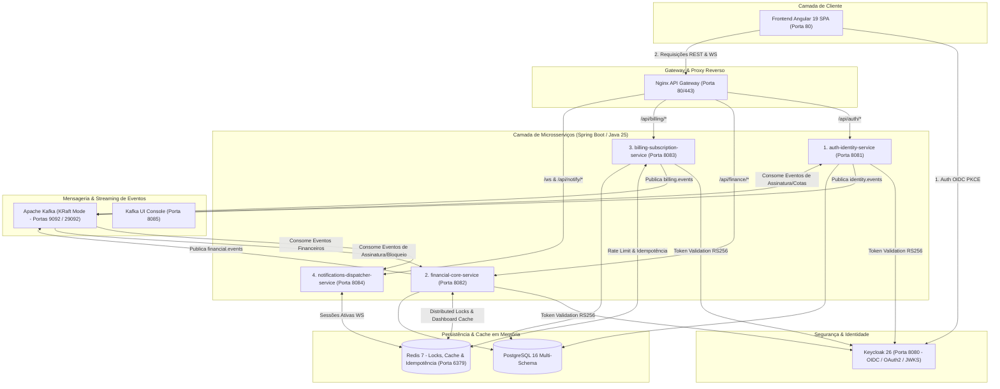

# Plano Arquitetural: Ecossistema Event-Driven (Apache Kafka), 4 Microsserviços, DDD de Mercado, Redis e Keycloak

**Documento Técnico Oficial de Arquitetura & Evolução**  
**Projeto:** Controlei — Plataforma de Gestão Financeira Familiar  
**Público-alvo & Escala:** 1.000+ Usuários Ativos Concorrentes  
**Paradigma:** Arquitetura Orientada a Eventos (EDA), DDD Pragmático de Mercado, Clean Architecture Hexagonal, Microsserviços e Cache Distribuído.

> **Status: plano, nao implementado.** Este documento descreve uma evolucao para 4 microsservicos com Keycloak.
> Hoje o Controlei e uma API unica (Spring Boot) com autenticacao JWT propria, Kafka com Transactional Outbox e
> Redis para idempotencia. O Keycloak nao esta integrado e nao faz parte do Compose. O estado real e as pendencias
> estao em `specs/07-controlei.md` do repositorio JavAI.

---

## 1. Sumário Executivo & Decisões Arquiteturais

Para atender à demanda de **1.000+ usuários concorrentes** com isolamento de domínios, alta disponibilidade e modelo SaaS monetizável, o ecossistema do **Controlei** é estruturado em **4 APIs (Microsserviços) Especializadas**, integradas via **Apache Kafka (KRaft)**, **Redis 7**, **Keycloak 26** e **PostgreSQL 16**.

### 1.1. As 4 APIs do Ecossistema:
1. **`auth-identity-service` (Porta 8081):** Gestão de Identidade, Famílias, Membros, Permissões (RBAC) e integração OIDC/Keycloak.
2. **`financial-core-service` (Porta 8082):** Core Financeiro Integrado (Banking, Transações, Cartões & Faturas, Divisão Familiar/Splits e Orçamentos/Metas).
3. **`billing-subscription-service` (Porta 8083):** Gestão de Assinaturas SaaS (Trial 30 dias, Individual, Familiar com 2 dependentes inclusos + dependentes extras avulsos, Webhooks e Cotas).
4. **`notifications-dispatcher-service` (Porta 8084):** Hub de Notificações em Tempo Real (WebSocket para Angular, In-App Push, E-mail e WhatsApp/SMS).

---

## 2. Diagrama Arquitetural do Ecossistema



---

## 3. Especificação das 4 APIs

### 3.1. `auth-identity-service` (Porta 8081)
- **Bounded Context:** `Identity & Family Membership`
- **Responsabilidades:**
  - Cadastro de responsáveis e convites de membros familiares.
  - Vínculo hierárquico familiar (`FamilyAggregate` e `FamilyMemberAggregate`).
  - Aplicação de regras de permissão (RBAC): `FAMILY_ADMIN` vs `FAMILY_MEMBER`.
  - Validação da cota máxima de dependentes permitida pelo plano de assinatura ativo.
  - Integração com Keycloak para autenticação federada e emissão de tokens JWT com claims de `family_id` e `role`.
- **Eventos Produzidos:**
  - `UserRegisteredEvent` (dados do novo usuário).
  - `FamilyCreatedEvent` (criação do núcleo familiar).
  - `FamilyMemberAddedEvent` (novo dependente cadastrado).
  - `FamilyMemberRemovedEvent` (remoção de membro da família).
- **Eventos Consumidos:**
  - `MemberQuotaUpdatedEvent` (atualiza limite de dependentes a partir do Billing).
  - `SubscriptionBlockedEvent` (bloqueia login de membros inadimplentes).

---

### 3.2. `financial-core-service` (Porta 8082)
- **Bounded Contexts Agrupados:** `Banking`, `Transactions`, `Cards`, `Expense Splits` e `Budgets`.
- **Responsabilidades:**
  - **Banking & Contas:** Contas bancárias físicas e digitais, saldos em tempo real, extratos e conciliação.
  - **Transações:** Receitas, despesas, categorias estruturadas, comprovantes/anexos e transações recorrentes.
  - **Cartões & Faturas:** Cartões compartilhados da casa, faturas mensais, limites individuais por membro e parcelamentos.
  - **Divisão Familiar (Splits):** Cálculo inteligente de divisão de despesas (proporcional ou igualitária) e geração de menor número de PIX para liquidação.
  - **Orçamentos & Metas:** Tetos mensais por categoria com tolerância percentual e metas financeiras de poupança.
- **Uso do Redis:**
  - *Distributed Lock (Redisson)* na atualização de saldos de contas para evitar *race conditions* concorrentes.
  - *Cache de Leitura* para Dashboards individuais e familiares (TTL 10 minutos, invalidado via eventos).
- **Eventos Produzidos:**
  - `TransactionCreatedEvent`, `TransactionUpdatedEvent`, `TransactionDeletedEvent`.
  - `CreditCardInvoiceClosedEvent`, `CreditCardInvoicePaidEvent`.
  - `ExpenseSplitCreatedEvent`, `SplitSettlementCompletedEvent`.
  - `BudgetThresholdExceededEvent` (quando os gastos ultrapassam 80% ou 100% do teto).
- **Eventos Consumidos:**
  - `SubscriptionStatusChangedEvent` (bloqueia novos lançamentos se o plano estiver inativo).

---

### 3.3. `billing-subscription-service` (Porta 8083 — Novo Módulo de Assinaturas)
- **Bounded Context:** `SaaS Billing, Plans & Monetization`
- **Modelo de Planos do Controlei:**
  1. **Plano Trial (Degustação):** Gratuito por **30 dias**, liberando todos os recursos e até 2 dependentes.
  2. **Plano Individual:** Destinado a 1 único usuário, sem dependentes.
  3. **Plano Familiar Base:** Titular + até **2 dependentes inclusos** no valor da assinatura mensal/anual.
  4. **Dependentes Adicionais (Add-on Avulso):** Valor recorrente por membro extra adicionado à família (ex: +R$ 9,90/mês por cada dependente acima de 2).
- **Responsabilidades:**
  - Controle de ciclo de vida da assinatura: `TRIAL`, `ACTIVE`, `PAST_DUE`, `CANCELED`, `EXPIRED`.
  - Integração com Gateways de Pagamento (PIX Automático, Cartão de Crédito e Boleto).
  - Cálculo dinâmico da fatura mensal da assinatura (Plano Base + Quantidade de Membros Extras).
  - Webhooks de confirmação de pagamento e renovação.
- **Eventos Produzidos:**
  - `SubscriptionActivatedEvent` (libera acesso completo).
  - `SubscriptionRenewedEvent` (estende período de vigência).
  - `SubscriptionGracePeriodWarningEvent` (alerta de pagamento pendente).
  - `SubscriptionExpiredEvent` (revoga recursos premium / modo somente leitura).
  - `MemberQuotaUpdatedEvent` (notifica o `auth-service` sobre o novo teto de membros da família).

---

### 3.4. `notifications-dispatcher-service` (Porta 8084)
- **Bounded Context:** `Real-time Dispatcher & Omnichannel Alerts`
- **Responsabilidades:**
  - Servidor WebSocket (STOMP) integrado com o Frontend Angular para atualização instantânea de saldos, faturas e alertas na interface.
  - Central de Notificações In-App (persistência do histórico de notificações com status lida/não lida).
  - Disparos externos automatizados:
    - E-mail transacional (fechamento de fatura, comprovante de liquidação PIX, boas-vindas).
    - WhatsApp / SMS / Push Notifications no navegador.
- **Eventos Consumidos:**
  - Todos os tópicos do Kafka (`financial.events`, `billing.events`, `identity.events`).

---

## 4. Matriz de Tópicos e Eventos no Apache Kafka

| Tópico Kafka | Evento | Payload Principal | Produtor | Consumidores |
| :--- | :--- | :--- | :--- | :--- |
| `financial.transactions` | `TransactionCreatedEvent` | `transactionId`, `familyId`, `userId`, `amount`, `categoryId`, `type` | `financial-core` | `financial-core` (avalia orçamento assíncrono), `notifications` |
| `financial.transactions` | `TransactionDeletedEvent` | `transactionId`, `familyId`, `amount` | `financial-core` | `financial-core` (invalida cache Redis), `notifications` |
| `financial.splits` | `SplitSettledEvent` | `splitId`, `fromUserId`, `toUserId`, `amount`, `pixKey` | `financial-core` | `notifications` (alerta membro devedor/credor) |
| `financial.budgets` | `BudgetExceededEvent` | `budgetId`, `familyId`, `categoryName`, `percentage`, `spent` | `financial-core` | `notifications` (alerta push urgente no app) |
| `billing.subscriptions` | `SubscriptionActivatedEvent` | `familyId`, `planType`, `maxMembers`, `expiresAt` | `billing-service` | `auth-identity`, `financial-core`, `notifications` |
| `billing.subscriptions` | `SubscriptionExpiredEvent` | `familyId`, `graceDaysRemaining` | `billing-service` | `auth-identity` (aplica bloqueio), `notifications` |
| `billing.subscriptions` | `MemberQuotaUpdatedEvent` | `familyId`, `allowedExtraMembers`, `totalMaxMembers` | `billing-service` | `auth-identity` (atualiza limite de membros) |
| `identity.members` | `MemberInvitedEvent` | `familyId`, `memberEmail`, `role`, `invitedBy` | `auth-identity` | `notifications` (envia e-mail de convite) |

---

## 5. Por que Manter o Redis Concomitante ao Kafka?

| Responsabilidade | **Redis 7** (Memória / Ultra Baixa Latência) | **Apache Kafka** (Streaming Persistente de Eventos) |
| :--- | :--- | :--- |
| **Cache de Dashboards** | **Sim (< 1ms)** — Impede 1.000 usuários de sobrecarregarem o PostgreSQL. | Não é adequado para consultas síncronas de leitura pontual. |
| **Distributed Locks** | **Sim (`Redisson Lock`)** — Evita débitos simultâneos concorrentes no mesmo saldo. | Não provê primitivas de lock síncrono em memória. |
| **Idempotência de Mensagens** | **Sim (`SETNX event_id`)** — Garante que nenhum consumidor processe o mesmo evento 2x. | Garante *at-least-once*, mas requer deduplicação no consumidor. |
| **Log Imutável e Auditoria** | Não retém histórico longo em disco de forma durável. | **Sim** — Log permanente, particionado e auditável para sempre. |
| **Desacoplamento Assíncrono**| Limitado a pub/sub efêmero. | **Sim** — Filas com replay histórico, backpressure e Dead Letter Queues (DLQ). |

---

## 6. Papel e Viabilidade do Keycloak 26

1. **Centralização de Identidade (IAM):** O Keycloak gerencia senhas criptografadas (Argon2/Bcrypt), autenticação multifator (MFA/TOTP), fluxo PKCE seguro para o Angular SPA e recuperação de conta.
2. **Stateless Resource Server:** Os microsserviços Spring Boot **não precisam consultar banco de dados para validar tokens**; validam a assinatura digital RS256 localmente em memória através das chaves públicas obtidas do endpoint JWKS (`/realms/controlei/protocol/openid-connect/certs`).
3. **Escalabilidade:** Permite escalar os microsserviços de negócio horizontalmente sem sobrecarregar o banco com consultas de sessão.

---

## 7. Estrutura de Diretórios Alvo no Repositório

```
controlei/
├── docker-compose.yml                      # Orquestração completa de todos os containers
├── nginx/
│   └── nginx.conf                          # Gateway com roteamento para as 4 APIs e Frontend
├── docs/
│   └── plano_arquitetura_event_driven_4_apis.md
├── front/                                  # Angular 19 SPA
└── back/
    ├── pom.xml                             # Maven Parent Multi-Module
    ├── shared-events/                      # Biblioteca compartilhada de Eventos Kafka e DTOs
    ├── auth-identity-service/              # API 1: Autenticação, Famílias e Membros (8081)
    ├── financial-core-service/             # API 2: Banking, Transações, Cartões, Splits, Tetos (8082)
    ├── billing-subscription-service/       # API 3: Assinaturas SaaS, Planos e Dependentes Extras (8083)
    └── notifications-dispatcher-service/   # API 4: WebSocket, In-App Push e E-mails (8084)
```

---

## 8. Cronograma de Implementação em Fases

### Fase 1: Infraestrutura Docker & Mensageria Base
- [x] Atualizar `docker-compose.yml` com Kafka KRaft, Kafka UI, Keycloak 26, Redis 7, Postgres 16 e Nginx.
- [ ] Configurar o módulo `shared-events` com os contratos de Domain Events serializáveis em JSON.

### Fase 2: Construção e Separação dos 4 Serviços Backend
- [ ] **`auth-identity-service`**: Extrair domínio de autenticação e família, conectar produtor Kafka e configurar validação de cotas.
- [ ] **`financial-core-service`**: Consolidar domínios financeiros com Clean Architecture, emitir eventos de transações e integrar locks com Redis.
- [ ] **`billing-subscription-service`**: Implementar motor de planos (Trial 30d, Individual, Familiar com 2 dependentes + extras avulsos) e eventos de ciclo de vida.
- [ ] **`notifications-dispatcher-service`**: Criar consumidores Kafka e endpoint WebSocket STOMP.

### Fase 3: Roteamento no API Gateway Nginx & Frontend
- [ ] Mapear as rotas no `nginx.conf`:
  - `/api/auth/*` -> `auth-identity-service:8081`
  - `/api/finance/*` -> `financial-core-service:8082`
  - `/api/billing/*` -> `billing-subscription-service:8083`
  - `/api/notify/*` e `/ws` -> `notifications-dispatcher-service:8084`
- [ ] Atualizar serviços do Frontend Angular para consumir os endpoints através do Gateway.

### Fase 4: Validação de Alta Concorrência (1.000 Usuários)
- [ ] Testar publicação e consumo em massa de eventos no Kafka UI (`http://localhost:8085`).
- [ ] Validar tempo de resposta dos dashboards abaixo de 50ms utilizando cache Redis.
- [ ] Garantir resiliência contra falhas através de Dead Letter Queues (`.DLT`).
