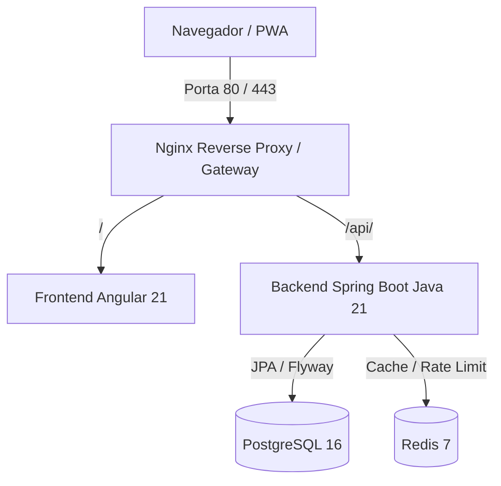
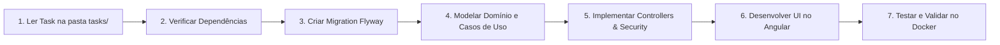

# 🧭 Guia Mestre de Orquestração para Agentes de IA e Desenvolvedores

> **Projeto:** Controlei — Gestão Financeira Familiar e Pessoal  
> **Objetivo deste documento:** Servir como fonte única de verdade arquitetural e orquestradora para que agentes de IA e engenheiros de software compreendam o projeto de ponta a ponta e executem as tarefas de implementação de forma consistente, padronizada e segura.

---

## 1. Visão Geral do Produto e Princípios Fundamentais

O **Controlei** foi concebido sob a premissa de que o controle financeiro de uma família não é apenas a soma de despesas individuais, mas sim uma dinâmica colaborativa com diferentes níveis de autonomia e responsabilidade.

### 👑 Regras de Ouro do Negócio (Invioláveis)
1. **Multi-tenancy por Família (`family_id`):** Todo dado financeiro (conta, categoria, transação, dívida, cartão, investimento) pertence obrigatoriamente a uma família. O isolamento entre famílias é absoluto.
2. **Hierarquia de Papéis:**
   - **`RESPONSIBLE` (Responsável):** Pode cadastrar membros, visualizar e editar registros de qualquer pessoa da família.
   - **`MEMBER` (Membro):** Visualiza o painel consolidado da família, mas **só tem permissão de escrita/edição sobre seus próprios registros**.
3. **Imutabilidade e Rastreabilidade (*Soft Delete* e Auditoria):**
   - Nenhuma entidade financeira de negócio é deletada fisicamente via `DELETE FROM`.
   - Utiliza-se *soft delete* (`deleted_at`, `deleted_by`).
   - Toda entidade possui `created_at`, `created_by`, `updated_at`, `updated_by`.
4. **Precisão Monetária:**
   - **Nunca** utilizar tipos de ponto flutuante (`float`/`double`) para dinheiro.
   - Usar `BigDecimal` no Java, `DECIMAL(19, 4)` no PostgreSQL e formatação monetária segura no Frontend.
5. **Evolução de Banco via Flyway:**
   - Toda alteração estrutural no banco de dados deve ser versionada através de scripts SQL sequenciais (`V{N}__nome_da_migration.sql`).

---

## 2. Stack Tecnológica e Arquitetura do Sistema



### Backend (Java 21 + Spring Boot 3.x)
Segue os preceitos de **Clean Architecture** e **Domain-Driven Design (DDD)** prático:
* `br.com.controlei.domain`: Regras de negócio puras, entidades ricas, DTOs de negócio, enums e contratos de repositório/serviços externos (sem anotações do Spring ou banco).
* `br.com.controlei.application`: Casos de uso (Use Cases / Services), orquestração de fluxo, mappers de DTO/Entity, controllers REST e exceções da aplicação.
* `br.com.controlei.infrastructure`: Detalhes técnicos, implementações Spring Data JPA, adaptadores de repositório, configuração de segurança (Spring Security / JWT), clientes HTTP e integrações externas.

### Frontend (Angular 21 + Bootstrap 5.3 + TypeScript)
* Arquitetura baseada em **Core** (interceptors, guards, serviços de sessão), **Shared** (componentes reutilizáveis, pipes, modais) e **Features** (módulos de negócio com lazy loading: accounts, transactions, debts, investments, dashboard, etc.).
* Testes unitários com **Vitest** e **JSDOM**.

### Infraestrutura & Docker
* Todo o ecossistema roda localmente via **Docker Compose**:
  * `nginx`: Gateway reverso (porta `80`), roteando front e back com cabeçalhos de segurança e rate limit.
  * `front`: Build estático do Angular servido via Nginx leve.
  * `back`: Imagem Eclipse Temurin 21 JRE rodando Spring Boot com usuário não-root.
  * `postgres`: PostgreSQL 16 Alpine com healthcheck.
  * `redis`: Redis 7 Alpine para cache e tokens.

---

## 3. Guia de Execução para Agentes de IA

Quando você (agente) for solicitado a implementar uma tarefa, siga rigorosamente este fluxo de trabalho:



### Checklist Obrigatório por Feature:
1. **Migration SQL:** Se houver novas tabelas ou colunas, criar `back/src/main/resources/db/migration/VX__descricao.sql`.
2. **Isolamento no AuthorizationService:** Sempre chamar `authorizationService.requireCanWrite(resourceFamilyId, resourceUserId)` nas operações de mutação.
3. **Auditoria:** Herdar de `AuditableEntity` para persistência automática de datas e usuários de auditoria.
4. **Tratamento de Exceções:** Lançar exceções tipadas de domínio (`NotFoundException`, `ForbiddenException`, `BusinessValidationException`), que serão capturadas pelo `GlobalExceptionHandler`.
5. **Testes:** Criar testes de integração (`@SpringBootTest`) cobrindo cenários de sucesso, erro de validação e tentativa de invasão cross-família.
6. **Frontend:** Adicionar o serviço no Core, formulários reativos com validação, componentes com feedback visual e tratamento de erro via Toast/Alert.

---

## 4. Matriz de Priorização das Tarefas (Roadmap)

As tarefas detalhadas encontram-se na pasta [`implementacao/tasks/`](./tasks/). Siga a ordem recomendada abaixo:

| Fase | Task | Descrição | Impacto |
| :---: | :--- | :--- | :--- |
| **Fase 1: Segurança & Hardening** | [TASK-01](./tasks/TASK-01-seguranca-hardening-jwt-ratelimit-cookies.md) | JWT em env, Refresh Token, Rate Limiting e Cookies HttpOnly | 🔴 Crítico |
| **Fase 2: Gestão Financeira Essencial** | [TASK-02](./tasks/TASK-02-cartao-credito-faturas.md) | Cartões de crédito, limites, parcelas e fatura mensal | 🟠 Alto |
| | [TASK-03](./tasks/TASK-03-transacoes-recorrentes-assinaturas.md) | Contas fixas, assinaturas e scheduler automático | 🟠 Alto |
| | [TASK-04](./tasks/TASK-04-orcamento-mensal-alertas.md) | Orçamento por categoria (50/30/20) e alertas de limite | 🟠 Alto |
| **Fase 3: Engajamento Familiar** | [TASK-05](./tasks/TASK-05-metas-cofrinhos-familiares.md) | Metas conjuntas, cofrinhos e aportes colaborativos | 🟡 Médio |
| | [TASK-06](./tasks/TASK-06-divisao-inteligente-contas-splitwise.md) | Divisão de contas familiar (Split Bill / Acerto de contas) | 🟡 Médio |
| **Fase 4: Inteligência & Automação** | [TASK-07](./tasks/TASK-07-investimentos-avancados-proventos.md) | Aportes/resgates, rentabilidade e dividendos | 🟡 Médio |
| | [TASK-08](./tasks/TASK-08-leitura-inteligente-comprovantes-ocr-ia.md) | OCR e IA para extrair cupom fiscal e comprovante PIX | 🚀 Diferencial |
| | [TASK-09](./tasks/TASK-09-open-finance-sincronizacao-bancaria.md) | Sincronização bancária automática via Open Finance | 🚀 Diferencial |
| **Fase 5: Operação, Relatórios & DX** | [TASK-10](./tasks/TASK-10-relatorios-exportacao-irpf.md) | Exportação de relatórios PDF, Excel e IRPF | 🟢 Operacional |
| | [TASK-11](./tasks/TASK-11-notificacoes-push-email.md) | Notificações push e e-mail para vencimentos e alertas | 🟢 Operacional |
| | [TASK-12](./tasks/TASK-12-observabilidade-metricas-auditoria.md) | Prometheus, Actuator, Grafana e log de auditoria detalhado | 🟢 Operacional |

---

## 5. Como Testar e Executar no Docker

Para subir todo o ecossistema com um único comando:

```bash
# 1. Copie o arquivo de variáveis de ambiente
cp .env.example .env

# 2. Suba todos os containers (Postgres, Redis, Backend, Frontend, Nginx)
docker compose up --build -d

# 3. Verifique os logs
docker compose logs -f

# 4. Acesse no navegador:
# Gateway / Aplicação Completa: http://localhost
# API Health Check: http://localhost/api/v1/health
```
