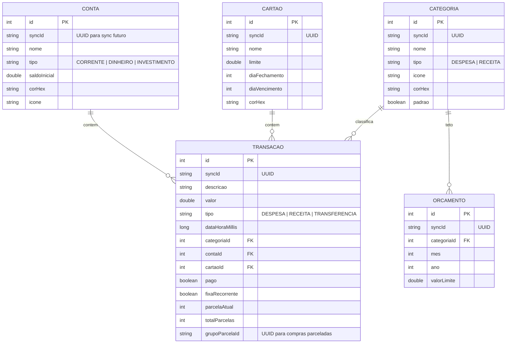

# 📱 Fase 01: App Android Individual (100% Local / On-Device)

> **Status:** Em Planejamento / Próxima a Executar  
> **Plataforma:** Android Nativo  
> **Linguagem:** Kotlin  
> **UI Toolkit:** Jetpack Compose + Material Design 3  
> **Arquitetura:** Padrão Prático MVC / MVVM no Android  
> **Persistência:** Room Database (SQLite) no próprio aparelho  
> **Dependência Externa:** Nenhuma (Zero servidores, 100% autônomo e offline)  

---

## 1. Objetivo da Fase 01

Construir um aplicativo Android moderno, veloz e intuitivo para **controle financeiro individual**. O usuário pode baixar e utilizar imediatamente, sem fricção de cadastro ou login obrigatório, com todos os seus dados e cálculos processados com segurança no próprio dispositivo.

---

## 2. Padrão Arquitetural: MVC / MVVM Prático

```
┌────────────────────────────────────────────────────────┐
│                        VIEW                            │
│  • Telas em Jetpack Compose (UI Declarativa)          │
│  • Componentes: Cards de Saldo, Gráficos, Teclado      │
│  • Captura cliques e exibe feedback imediato           │
└───────────────────────────▲────────────────────────────┘
                            │ (Observa Estado / Dispara Ações)
┌───────────────────────────▼────────────────────────────┐
│              CONTROLLER / VIEWMODEL                    │
│  • Gerencia o Estado da Tela (UIState via StateFlow)   │
│  • Executa regras de cálculo (saldos, faturas, tetos)  │
│  • Chama os métodos do Repositório/Model               │
└───────────────────────────▲────────────────────────────┘
                            │ (Lê e Grava Dados)
┌───────────────────────────▼────────────────────────────┐
│                        MODEL                           │
│  • Entidades Room (@Entity) com UUIDs Universais       │
│  • DAOs (@Dao com SQL nativo)                          │
│  • Repositórios Locais (Abstração de acesso)          │
└────────────────────────────────────────────────────────┘
```

---

## 3. Escopo Funcional do MVP Individual

### 3.1 Gestão do Dia a Dia (Operacional)
- **Lançamento Rápido (Quick Add):**
  - Registro de despesa ou receita em menos de 5 segundos.
  - Valor com teclado financeiro facilitado.
  - Descrição, Categoria, Conta/Carteira/Cartão, Data e Status (Pago / Pendente).
- **Categorias Pré-definidas + Personalizadas:**
  - *Despesas:* Alimentação, Mercado, Transporte, Moradia, Lazer, Saúde, Educação, Outros.
  - *Receitas:* Salário, Rendimentos, Freelance, Vendas, Presentes, Outros.
  - Cada categoria com ícone e cor customizável.
- **Formas de Pagamento e Contas:**
  - Carteira (Dinheiro), Conta Corrente / PIX, Poupança / Investimento.
- **Extrato Diário:** Lista de transações do dia com agrupamento por datas e busca textual.

### 3.2 Gestão Mensal (Estratégico)
- **Dashboard Resumo do Mês:**
  - Total de Receitas do Mês vs Total de Despesas.
  - Saldo Atual e Saldo Previsto até o fim do mês (considerando despesas pendentes).
- **Gestão de Cartões de Crédito:**
  - Cadastro de Cartões: Limite total, dia de fechamento e dia de vencimento.
  - Compras à vista e **parceladas** (geração automática das parcelas futuras no banco).
  - Visualização da fatura atual aberta e projeção de faturas futuras.
- **Despesas e Receitas Fixas (Recorrentes):**
  - Aluguel, assinaturas (streaming, internet), salário com repetição automática.
- **Orçamentos Mensais por Categoria (Budgets):**
  - Definição de limites de gastos por categoria (ex: "Lazer: R$ 500/mês").
  - Indicador visual de consumo (Verde: até 70%, Amarelo: 70-90%, Vermelho: estourou).
- **Relatórios Visuais no App:**
  - Gráfico de pizza de gastos por categoria.
  - Comparativo mensal de entradas vs saídas.

---

## 4. Modelagem do Banco de Dados Local (Room / SQLite)

> 💡 **Preparação para Fase 2:** Todas as entidades possuem um `syncId` (UUID em String) para que, quando o usuário decidir ativar o compartilhamento familiar na Fase 2, os dados locais sincronizem com o PostgreSQL externo sem necessidade de alterar a estrutura das tabelas.



---

## 5. Estrutura de Diretórios e Pacotes (Android)

```
AppControlei/app/src/main/java/com/controlei/app/
│
├── data/                       # [MODEL]
│   ├── local/
│   │   ├── AppDatabase.kt      # Instância do Room com Migrations e Seed
│   │   ├── dao/
│   │   │   ├── TransacaoDao.kt
│   │   │   ├── ContaDao.kt
│   │   │   ├── CartaoDao.kt
│   │   │   ├── CategoriaDao.kt
│   │   │   └── OrcamentoDao.kt
│   │   └── entities/
│   │       ├── TransacaoEntity.kt
│   │       ├── ContaEntity.kt
│   │       ├── CartaoEntity.kt
│   │       ├── CategoriaEntity.kt
│   │       └── OrcamentoEntity.kt
│   └── repository/
│       ├── TransacaoRepository.kt
│       ├── ContaRepository.kt
│       ├── CartaoRepository.kt
│       └── CategoriaRepository.kt
│
├── ui/                         # [VIEW & CONTROLLER]
│   ├── theme/                  # Cores, Tipografia e Temas Claro/Escuro
│   │   ├── Color.kt
│   │   ├── Theme.kt
│   │   └── Type.kt
│   ├── components/             # Componentes Visuais Reutilizáveis
│   │   ├── TopAppBarControlei.kt
│   │   ├── CardSaldo.kt
│   │   ├── ItemTransacao.kt
│   │   ├── TecladoFinanceiro.kt
│   │   └── GraficoPizzaSimples.kt
│   └── screens/                # Telas (Compose View + ViewModel/Controller)
│       ├── dashboard/
│       │   ├── DashboardScreen.kt
│       │   └── DashboardViewModel.kt
│       ├── transacao/
│       │   ├── NovaTransacaoScreen.kt
│       │   └── NovaTransacaoViewModel.kt
│       ├── extrato/
│       │   ├── ExtratoScreen.kt
│       │   └── ExtratoViewModel.kt
│       ├── cartoes/
│       │   ├── CartoesScreen.kt
│       │   └── CartoesViewModel.kt
│       ├── orcamentos/
│       │   ├── OrcamentosScreen.kt
│       │   └── OrcamentosViewModel.kt
│       └── relatorios/
│           ├── RelatoriosScreen.kt
│           └── RelatoriosViewModel.kt
│
├── navigation/                 # Rotas e Bottom Navigation Bar
│   ├── AppNavHost.kt
│   └── ScreenRoutes.kt
│
└── utils/                      # Formatadores e Extensões
    ├── CurrencyUtils.kt        # R$ 1.250,00 (Locale pt-BR)
    └── DateUtils.kt            # Manipulação de datas e meses
```

---

## 6. Checklist de Execução da Fase 01

* [ ] **Etapa 1.1:** Setup inicial do projeto Android no diretório com Gradle Kotlin DSL (`build.gradle.kts`).
* [ ] **Etapa 1.2:** Configuração das dependências (Jetpack Compose, Room Database, Material 3, Navigation, Coroutines).
* [ ] **Etapa 1.3:** Implementação do Design System (Theme Dark/Light, paleta esmeralda/índigo, componentes base).
* [ ] **Etapa 1.4:** Criação das Entities, DAOs e AppDatabase com Seed automático de categorias.
* [ ] **Etapa 1.5:** Criação do Repositório de Dados e lógica de cálculo de saldos.
* [ ] **Etapa 1.6:** Construção da tela de **Nova Transação** (Formulário ágil com suporte a parcelas e cartões).
* [ ] **Etapa 1.7:** Construção da tela de **Dashboard** (Cards de saldo, receitas/despesas e extrato do dia).
* [ ] **Etapa 1.8:** Construção da tela de **Extrato Completo** com filtros por mês, tipo e categoria.
* [ ] **Etapa 1.9:** Construção da tela de **Cartões e Faturas** (fechamento, vencimento e limite).
* [ ] **Etapa 1.10:** Construção da tela de **Orçamentos & Relatórios** (barras de progresso e gráfico de pizza).
* [ ] **Etapa 1.11:** Validação completa e testes em dispositivo/emulador Android.
