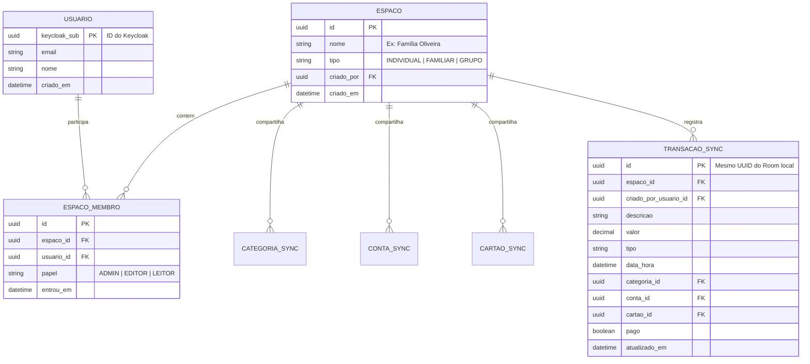

# 🛡️ Fase 02: Backend, Modo Familiar, APIs & Segurança

> **Status:** Planejada para execução após a Fase 01  
> **Objetivo:** Adicionar compartilhamento familiar e em grupos, sincronização em nuvem e painel web corporativo  
> **Autenticação & Segurança:** Keycloak (OAuth2, OIDC, JWT, RBAC)  
> **Banco de Dados Central:** PostgreSQL  
> **Tecnologias de Backend Avaliadas:** Java 25 (Spring Boot 3.x + Virtual Threads) ou Go (Golang)  
> **Tecnologias de Frontend Web Avaliadas:** Angular (v19+) ou React  

---

## 1. Visão Geral da Fase 02

Na Fase 02, o **Controlei** evolui de um app puramente local para uma **plataforma financeira colaborativa**. O usuário poderá convidar o cônjuge, familiares ou amigos de república para gerenciar orçamentos compartilhados, mantendo sincronização em tempo real entre celulares e acesso opcional por um painel web no computador.

```
┌─────────────────┐       ┌─────────────────┐
│   App Android   │       │   Portal Web    │
│  (Celular Pai)  │       │ (Angular/React) │
└────────┬────────┘       └────────┬────────┘
         │                         │
         │  HTTPS / Bearer JWT     │
         ▼                         ▼
┌────────────────────────────────────────────────────────┐
│                      KEYCLOAK                          │
│   (Identity & Access Management, OAuth2, RBAC, JWT)    │
└──────────────────────────┬─────────────────────────────┘
                           │ Validação de Token
┌──────────────────────────▼─────────────────────────────┐
│                 CORE SERVICE (API)                     │
│  • Gerenciamento de Famílias / Espaços (Workspaces)    │
│  • Gestão de Membros e Convites (Link / Código)        │
│  • Sincronização Bidirecional (Room ⟷ PostgreSQL)     │
│  • Auditoria (Quem lançou cada despesa)                │
└──────────────────────────┬─────────────────────────────┘
                           │
┌──────────────────────────▼─────────────────────────────┐
│                 BANCO POSTGRESQL                       │
│    (Tabelas Relacionais com Isolamento por Família)    │
└────────────────────────────────────────────────────────┘
```

---

## 2. Estrutura Enxuta de APIs (Sem Complexidade Desnecessária)

Para evitar o excesso de microsserviços que geram sobrecarga de manutenção, a arquitetura da Fase 02 será composta por **apenas 2 blocos principais**:

### 🔑 1. Camada de Autenticação: Keycloak (Pronto e Robusto)
- **Papel:** Provedor de Identidade (IAM) Open Source líder de mercado.
- **Recursos Nativos:**
  - Login por E-mail/Senha, Google Sign-In, Apple ID.
  - Emissão de tokens **JWT (JSON Web Token)** criptografados com expiração e refresh tokens.
  - Controle de perfis de acesso (**RBAC**): `ADMIN_FAMILIA`, `MEMBRO_FAMILIA`, `VISUALIZADOR`.
  - Recuperação de senha, autenticação em dois fatores (2FA/MFA) sem precisar programar do zero.

### ⚙️ 2. API Principal: `core-service`
- **Papel:** Concentra as regras de negócio de múltiplos usuários e a persistência em nuvem.
- **Endpoints Chave:**
  - `/api/v1/workspaces`: Criar, listar e editar famílias/espaços.
  - `/api/v1/workspaces/{id}/members`: Convidar membros (por código ou e-mail) e alterar papéis.
  - `/api/v1/sync`: Endpoint inteligente que recebe o lote de transações do Room local e devolve as atualizações feitas por outros membros da família.
  - `/api/v1/categories` & `/api/v1/accounts`: Sincronização das categorias e contas compartilhadas da família.

---

## 3. Comparativo de Tecnologias Backend: Java 25 vs Go (Golang)

Ambas as opções são extremamente modernas e performáticas. Abaixo está a análise para a decisão:

### Opção A: Java 25 (com Spring Boot 3.4+ / Quarkus)
* **Pontos Fortes:**
  - **Virtual Threads (Project Loom):** Concorrência massiva com consumo ínfimo de memória e código síncrono simples.
  - **Ecossistema Empresarial:** Integração nativa com Keycloak (Spring Security OAuth2 Resource Server) configurada em poucas linhas de código.
  - **Spring Data JPA / Hibernate / Flyway:** Migrations de banco automáticas e mapeamento relacional maduro.
* **Consumo de Memória:** ~150MB a 300MB de RAM (ou ~40MB se compilado com GraalVM Native Image).

### Opção B: Go (Golang com Gin / Fiber / Echo)
* **Pontos Fortes:**
  - **Velocidade e Eficiência Extrema:** Inicialização em milissegundos e consumo de memória ridículo (~15MB a 30MB de RAM).
  - **Binário Único:** Facilidade total de deploy (1 arquivo compilado sem necessidade de JVM ou dependências).
  - **Simplicidade de Código:** Sem mágica de frameworks pesados, código altamente explícito e direto.
* **Integração com Keycloak:** Feita via middleware de validação de assinatura pública de JWT (JWKS).

> 💡 **Recomendação:**
> - Se o objetivo for **rapidez na integração de segurança com Keycloak e ecossistema corporativo completo**, **Java 25 + Spring Boot** é a escolha mais produtiva.
> - Se o objetivo for **custo mínimo de servidor/hospedagem (rodando em VPS barata de US$ 3/mês) e ultra-performance**, **Go (Golang)** é imbatível.

---

## 4. Banco de Dados Central: PostgreSQL

O PostgreSQL será o banco central multi-tenant:



---

## 5. Frontend Web: Angular (v19+) vs React

Para o portal web onde a família poderá acessar relatórios no computador:

| Critério | Angular (v19+ com Signals) | React (Next.js / Vite) |
| :--- | :--- | :--- |
| **Arquitetura** | Framework completo e opinado (HTTP Client, Router, Forms e State inclusos) | Biblioteca flexível (necessita escolher libs de rotas, formulários e estado) |
| **Integração Keycloak** | Nativa via biblioteca oficial `keycloak-angular` | Excelente via `@react-keycloak/web` ou `oidc-client-ts` |
| **Manutenibilidade** | Padrões estritos em TypeScript, excelente para aplicações com viés corporativo | Grande ecossistema e flexibilidade visual |
| **Reatividade** | Nova API de **Signals** ultra-performática sem Zone.js | Hooks e Context / Zustand |

---

## 6. Mecanismo de Sincronização Offline-First (Room ⟷ PostgreSQL)

O app Android continuará funcionando normalmente sem internet. A sincronização ocorrerá em segundo plano:

1. **Geração de Dados:** Cada novo lançamento no celular recebe um `syncId = UUID.randomUUID()` e flag `syncStatus = PENDING`.
2. **Disparo de Sincronização:** Quando o celular detecta rede (via WorkManager ou ao abrir o app), envia o payload para `/api/v1/sync`.
3. **Resolução de Conflitos:** Estratégia *Last-Write-Wins* baseada no timestamp `updatedAt` com registro de auditoria (`created_by_user`).
4. **Atualização em Tempo Real:** Outros membros da família recebem a atualização instantaneamente ou na próxima abertura do app.

---

## 7. Checklist de Execução da Fase 02

* [ ] **Etapa 2.1:** Configuração do ambiente **Keycloak** (Docker Compose) com Realm `Controlei`, Clientes (Mobile e Web) e Roles.
* [ ] **Etapa 2.2:** Criação e modelagem do banco **PostgreSQL** com isolamento por `espaco_id` e migrations (Flyway / Golang-Migrate).
* [ ] **Etapa 2.3:** Criação da API **`core-service`** (Java 25 ou Go) com validação de JWT do Keycloak.
* [ ] **Etapa 2.4:** Implementação dos módulos de Espaços/Famílias, Convites e Membros.
* [ ] **Etapa 2.5:** Implementação do motor de sincronização em lote (`/api/v1/sync`).
* [ ] **Etapa 2.6:** Atualização do app Android para integrar login Keycloak e sincronizador com Room.
* [ ] **Etapa 2.7:** Desenvolvimento do portal web (Angular ou React) para consulta e gestão familiar.
