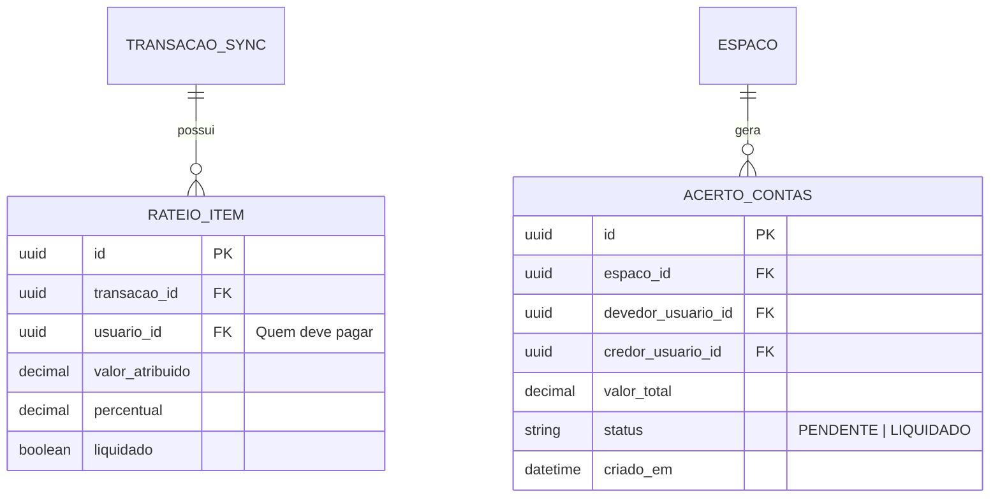

# 📊 Fase 03: Módulo Financeiro Avançado & SaaS

> **Status:** Planejada para execução após a Fase 02  
> **Objetivo:** Adicionar inteligência financeira, rateio familiar de despesas, automações avançadas e estrutura de SaaS  
> **Componente Principal:** API Financeira (`finance-service`)  
> **Recursos:** Divisão inteligente de gastos ("Quem deve para quem"), projeções financeiras, notificações push e relatórios executivos  

---

## 1. Visão Geral da Fase 03

Na Fase 03, o **Controlei** passa de um simples registrador de despesas para um **assistente financeiro inteligente**. Com múltiplos membros na família ou no grupo inserindo gastos, a API Financeira processa cálculos avançados de divisão proporcional de despesas, consolidação patrimonial e previsões futuras de caixa.

```
┌────────────────────────────────────────────────────────┐
│                   ECOSSISTEMA FASE 03                  │
│                                                        │
│  [ App Android ] ──┐                                   │
│                    ├──► [ Keycloak ] ──► [ Gateway ]   │
│  [ Portal Web ]  ──┘                        │          │
│                                  ┌──────────┴──────────┐
│                                  ▼                     ▼
│                           [ core-service ]     [ finance-service ]
│                           (Membros/Sync)       (Rateios/Projeções)
│                                  │                     │
│                                  └──────────┬──────────┘
│                                             ▼
│                                    [ Banco PostgreSQL ]
│                                    [ + Cache Redis ]
└────────────────────────────────────────────────────────┘
```

---

## 2. O Módulo Financeiro: `finance-service`

O `finance-service` pode ser implementado como um microsserviço dedicado (em **Java 25** ou **Go**) ou como um módulo modular integrado com o `core-service` para manter o deploy leve:

### 2.1 Principais Funcionalidades da API Financeira:

#### 1. Rateio Inteligente Familiar (Split Expenses)
- **Divisão Igualitária:** Divide o valor de uma despesa igualmente entre todos os membros ou selecionados.
- **Divisão Proporcional:** Divide as despesas com base na renda declarada de cada membro (ex: 60% para quem ganha mais, 40% para o cônjuge).
- **Cálculo de Liquidação ("Quem Deve Para Quem"):** Algoritmo que simplifica as dívidas cruzadas do grupo/família para o menor número de transações possíveis (ex: "João deve pagar R$ 85,00 para Maria").

#### 2. Projeção de Fluxo de Caixa (Forecast Anual)
- Análise de recorrência (salários fixos, assinaturas, compras parceladas em andamento).
- Projeção de saldo bancário futuro para os próximos 3, 6 e 12 meses.
- Alerta antecipado: *"Atenção: No mês de Dezembro o saldo projetado ficará negativo devido às parcelas acumuladas."*

#### 3. Alertas e Notificações Push Inteligentes (FCM)
- Notificação no celular quando a fatura do cartão estiver a 3 dias do fechamento/vencimento.
- Alerta ao atingir 80% e 100% do orçamento familiar de uma categoria (ex: "O orçamento de Mercado da família atingiu 90%").
- Notificação imediata quando outro membro da família fizer um lançamento de alto valor.

#### 4. Relatórios Analíticos e Exportação Executiva
- Geração de relatórios executivos em **PDF** formatado e planilhas **Excel (.xlsx) / CSV**.
- Gráficos de evolução patrimonial líquida (Ativos - Passivos).

---

## 3. Modelo de Dados do Módulo Financeiro



---

## 4. Estratégia de SaaS e Monetização

Com a plataforma completa (Individual + Familiar + Inteligência Financeira), o modelo SaaS pode ser ativado suavemente através de planos de assinatura integrados ao **Google Play Billing** e **Stripe (Web)**:

| Funcionalidade | Plano Gratuito (Free) | Plano Família / Pro (SaaS) |
| :--- | :--- | :--- |
| **Controle Individual Offline** | Ilimitado | Ilimitado |
| **Espaços Compartilhados** | 1 Espaço Familiar | Espaços Ilimitados (Família, Viagens, Projetos) |
| **Membros por Espaço** | Até 2 membros | Membros Ilimitados com controle de permissões |
| **Rateio Inteligente de Gastos** | Básico | Avançado (proporcional por renda + liquidação) |
| **Projeção de Fluxo de Caixa** | 1 mês à frente | 12 meses com simulações |
| **Exportação de Relatórios** | CSV simples | PDF Executivo formatado + Excel detalhado |
| **Anexo de Comprovantes em Nuvem** | Não incluso | Armazenamento seguro de recibos e notas |

---

## 5. Checklist de Execução da Fase 03

* [ ] **Etapa 3.1:** Implementação do algoritmo de rateio e liquidação de dívidas familiares no backend.
* [ ] **Etapa 3.2:** Criação dos endpoints de cálculo de faturas consolidadas e projeção de caixa futuro.
* [ ] **Etapa 3.3:** Integração com **Firebase Cloud Messaging (FCM)** para envio de Push Notifications em tempo real.
* [ ] **Etapa 3.4:** Atualização das telas do app Android e portal Web para exibir a aba "Rateio da Casa" e "Quem deve para quem".
* [ ] **Etapa 3.5:** Motor de geração de relatórios PDF no backend / client-side.
* [ ] **Etapa 3.6:** Integração com Google Play Billing para suporte opcional a planos de assinatura.
