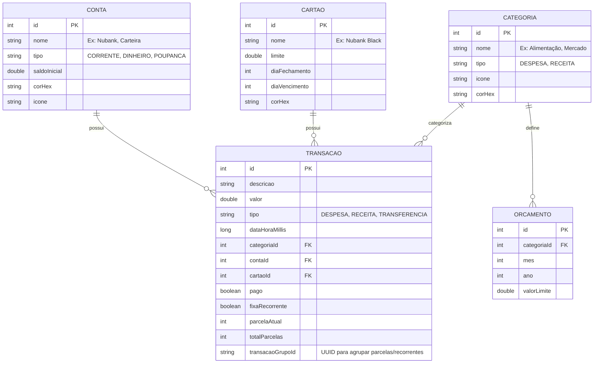

# 📱 Plano de Desenvolvimento: Controlei (Android)

> **Documento de Planejamento Estratégico, Arquitetural e Funcional**  
> **Versão:** 1.1 (Foco: MVP Individual 100% Local / On-Device)  
> **Plataforma:** Android Nativo (Kotlin + Jetpack Compose)  
> **Padrão de Arquitetura:** MVC / MVVM Prático no Android  
> **Persistência:** Banco de Dados Local (Room / SQLite)  
> **Evolução Futura:** Conexão com banco externo leve para compartilhamento familiar/grupos  

---

## 📑 Sumário

1. [Diretriz Principal & Filosofia do Projeto](#1-diretriz-principal--filosofia-do-projeto)
2. [Padrão de Arquitetura: MVC / MVVM no Android](#2-padrão-de-arquitetura-mvc--mvvm-no-android)
3. [Escopo do MVP Individual (Dia a Dia & Mensal)](#3-escopo-do-mvp-individual-dia-a-dia--mensal)
4. [Modelagem do Banco Local (Room / SQLite)](#4-modelagem-do-banco-local-room--sqlite)
5. [Estrutura de Pastas e Pacotes do Projeto](#5-estrutura-de-pastas-e-pacotes-do-projeto)
6. [Design de Telas & Fluxo de Navegação](#6-design-de-telas--fluxo-de-navegação)
7. [Roadmap de Desenvolvimento Passo a Passo](#7-roadmap-de-desenvolvimento-passo-a-passo)
8. [Planejamento para Futura Conexão Externa (Grupos/Família)](#8-planejamento-para-futura-conexão-externa-gruposfamília)

---

## 1. Diretriz Principal & Filosofia do Projeto

```
┌──────────────────────────────────────────────────────────────────┐
│                   CONTROLEI: APP 100% LOCAL                      │
│                                                                  │
│  [ Usuário ] ──► [ Interface Compose ] ──► [ Controller/VM ]    │
│                                                   │              │
│                                                   ▼              │
│                                        [ Banco Local Room/SQLite ]│
│                                                                  │
│  • Sem necessidade de login inicial                              │
│  • Funciona 100% offline com velocidade instantânea              │
│  • Todos os cálculos de saldo, despesas e faturas no próprio app │
└──────────────────────────────────────────────────────────────────┘
```

### 🎯 Princípios do MVP:
1. **Foco 100% no Uso Individual:** Resolver com excelência a vida financeira pessoal do usuário antes de abrir para múltiplos membros.
2. **Tudo no Próprio Aparelho (Local-First):**
   - Não depende de internet, APIs lentas ou servidores caros.
   - Os dados são salvos diretamente no banco SQLite nativo do Android via **Room**.
   - O app abre instantaneamente, sem telas de carregamento travadas por rede.
3. **Simplicidade Arquitetural (MVC / MVVM):** Código direto ao ponto, fácil de entender, manter e expandir.
4. **Base Preparada para Compartilhamento Futuro:** O banco local já nasce estruturado com identificadores que facilitarão sincronizar com um banco externo (ex: Firebase ou Supabase) no futuro para os modos Familiar e Grupos.

---

## 2. Padrão de Arquitetura: MVC / MVVM no Android

No ecossistema Android moderno com Kotlin e Jetpack Compose, a separação de responsabilidades (estilo MVC / MVVM) é dividida da seguinte forma:

```
┌────────────────────────────────────────────────────────┐
│                        VIEW                            │
│  • Telas em Jetpack Compose (UI Declarativa)          │
│  • Componentes visuais: Cards, Gráficos, Formulários   │
│  • Captura cliques e eventos do usuário                │
└───────────────────────────▲────────────────────────────┘
                            │ (Observa Estado / Dispara Ações)
┌───────────────────────────▼────────────────────────────┐
│              CONTROLLER / VIEWMODEL                    │
│  • Gerencia o Estado da Tela (UI State)                │
│  • Executa regras de cálculo (somas, orçamentos)       │
│  • Chama os métodos do Model (inserir, listar, filtrar)│
└───────────────────────────▲────────────────────────────┘
                            │ (Lê e Grava Dados)
┌───────────────────────────▼────────────────────────────┐
│                        MODEL                           │
│  • Entidades do Banco (Entity / Data Classes)          │
│  • Acesso a Dados (DAOs do Room Database / SQLite)     │
│  • Repositórios locais                                 │
└────────────────────────────────────────────────────────┘
```

- **Model:** Representa os dados e a persistência local (Room Entities + DAOs + Repositório).
- **View:** Interface 100% reativa construída com **Jetpack Compose** e Material Design 3.
- **Controller / ViewModel:** Contém a lógica da tela, processa os cálculos de totais, valida os dados e entrega o estado pronto para a View exibir.

---

## 3. Escopo do MVP Individual (Dia a Dia & Mensal)

### 3.1 Controle do Dia a Dia (Operacional Rápido)
- **Lançamento Ágil:**
  - Despesa ou Receita em menos de 5 segundos.
  - Campos: Valor, Descrição, Categoria, Conta/Cartão, Data, Pago/Pendente.
- **Categorias Pré-cadastradas + Personalizáveis:**
  - *Despesas:* Alimentação, Mercado, Transporte, Moradia, Saúde, Lazer, Educação, Outros.
  - *Receitas:* Salário, Rendimentos, Freelance, Vendas, Presentes, Outros.
- **Formas de Pagamento / Contas:**
  - Carteira (Dinheiro), Conta Corrente / PIX, Poupança / Investimento.
- **Extrato Diário:** Lista dos gastos do dia agrupados de forma clara.

### 3.2 Controle Mensal (Visão Estratégica)
- **Dashboard Resumo do Mês:**
  - Total de Receitas do Mês.
  - Total de Despesas do Mês.
  - Saldo Atual e Projeção até o fim do mês.
- **Gestão de Cartões de Crédito:**
  - Cadastro de Cartões (Limite, Dia de Fechamento, Dia de Vencimento).
  - Lançamento de compras à vista e **parceladas** (ex: 10x de R$ 50 gerando lançamentos automáticos nos próximos meses).
  - Visualização da fatura aberta e faturas futuras.
- **Despesas e Receitas Fixas (Recorrentes):**
  - Aluguel, academia, internet, salários com repetição automática todo mês.
- **Orçamentos Mensais por Categoria (Budgets):**
  - Definir limite de gasto por categoria (ex: "Alimentação: R$ 1.000/mês").
  - Barra de progresso visual (Verde: até 70%, Amarelo: 70-90%, Vermelho: estourou).
- **Relatórios Visuais Básicos:**
  - Gráfico de pizza de gastos por categoria.
  - Comparativo de Receitas vs Despesas do mês.

---

## 4. Modelagem do Banco Local (Room / SQLite)

As tabelas do banco de dados local do app serão modeladas em SQLite usando o framework **Room**:



---

## 5. Estrutura de Pastas e Pacotes do Projeto

Estrutura limpa, direta e modular dentro de `com.controlei.app`:

```
app/src/main/java/com/controlei/app/
│
├── data/                      # [MODEL - Camada de Dados]
│   ├── local/
│   │   ├── AppDatabase.kt     # Configuração do Room Database
│   │   ├── dao/               # Interfaces DAO (Consultas SQL)
│   │   │   ├── TransacaoDao.kt
│   │   │   ├── ContaDao.kt
│   │   │   ├── CartaoDao.kt
│   │   │   ├── CategoriaDao.kt
│   │   │   └── OrcamentoDao.kt
│   │   └── entities/          # Tabelas do SQLite (@Entity)
│   │       ├── TransacaoEntity.kt
│   │       ├── ContaEntity.kt
│   │       ├── CartaoEntity.kt
│   │       ├── CategoriaEntity.kt
│   │       └── OrcamentoEntity.kt
│   └── repository/            # Repositórios (Ponte entre DB e Controllers)
│       ├── TransacaoRepository.kt
│       ├── ContaRepository.kt
│       └── CategoriaRepository.kt
│
├── ui/                        # [VIEW & CONTROLLER]
│   ├── theme/                 # Design System (Cores, Tipografia, Shapes)
│   │   ├── Color.kt
│   │   ├── Theme.kt
│   │   └── Type.kt
│   ├── components/            # Componentes reutilizáveis
│   │   ├── TopAppBarControlei.kt
│   │   ├── CardSaldo.kt
│   │   ├── ItemTransacao.kt
│   │   ├── SeletorData.kt
│   │   └── TecladoFinanceiro.kt
│   └── screens/               # Telas (View + ViewModel/Controller)
│       ├── dashboard/         # Dashboard / Home
│       │   ├── DashboardScreen.kt
│       │   └── DashboardViewModel.kt
│       ├── transacao/         # Formulário de Lançamento (Novo Gasto/Receita)
│       │   ├── NovaTransacaoScreen.kt
│       │   └── NovaTransacaoViewModel.kt
│       ├── extrato/           # Lista Completa e Filtros
│       │   ├── ExtratoScreen.kt
│       │   └── ExtratoViewModel.kt
│       ├── cartoes/           # Gestão de Cartões e Faturas
│       │   ├── CartoesScreen.kt
│       │   └── CartoesViewModel.kt
│       ├── orcamentos/        # Planejamento Mensal
│       │   ├── OrcamentosScreen.kt
│       │   └── OrcamentosViewModel.kt
│       └── relatorios/        # Gráficos e Estatísticas
│           ├── RelatoriosScreen.kt
│           └── RelatoriosViewModel.kt
│
├── navigation/                # Navegação do App (Jetpack Compose Navigation)
│   ├── AppNavHost.kt
│   └── ScreenRoutes.kt
│
└── utils/                     # Formatadores de Moeda, Extensões de Data, etc.
    ├── CurrencyUtils.kt       # R$ 1.250,00
    └── DateUtils.kt           # 01/09/2026
```

---

## 6. Design de Telas & Fluxo de Navegação

A navegação principal utilizará uma **Bottom Navigation Bar** inferior com 4 a 5 abas rápidas:

```
┌────────────────────────────────────────────────────────┐
│ [ Topo: Mês Atual (ex: Setembro 2026) ◀  ▶ ]           │
├────────────────────────────────────────────────────────┤
│ 💳 CARD SALDO GERAL                                    │
│   Saldo Atual:  R$ 3.450,00                            │
│   ▲ Receitas:   R$ 5.000,00    ▼ Despesas: R$ 1.550,00 │
├────────────────────────────────────────────────────────┤
│ 📊 ORÇAMENTO DO MÊS (65% Utilizado)                    │
│   [██████████████████░░░░░░░░] R$ 1.550 / R$ 2.400     │
├────────────────────────────────────────────────────────┤
│ 🕒 ÚLTIMOS LANÇAMENTOS DO DIA                          │
│   • Supermercado       - R$ 142,50  (Cartão Nubank)    │
│   • Almoço             - R$  35,00  (PIX)              │
│   • Salário            + R$ 5.000,00 (Conta Corrente)  │
├────────────────────────────────────────────────────────┤
│   [ 🏠 Início ]  [ 📄 Extrato ]  [ ➕ ]  [ 💳 Cartões ]  [ 📊 Relatórios ] │
└────────────────────────────────────────────────────────┘
```

1. **Início (Dashboard):** Visão geral rápida do mês, saldo, resumo de orçamentos e últimos lançamentos.
2. **Extrato:** Lista completa com filtros avançados (por dia, mês, categoria, conta, pendente/pago).
3. **Botão Central Flutuante (+):** Abre o modal rápido de inclusão de Despesa, Receita ou Transferência.
4. **Cartões:** Resumo das faturas de cada cartão, limite disponível e compras parceladas.
5. **Relatórios & Orçamentos:** Gráficos visuais de onde o dinheiro está indo.

---

## 7. Roadmap de Desenvolvimento Passo a Passo

### 🟢 Etapa 1: Estrutura Base & Design System
* [ ] Criação do projeto Android Kotlin com Jetpack Compose.
* [ ] Configuração de dependências (`Room`, `Navigation Compose`, `Material3`, `Coroutines`).
* [ ] Criação do tema de cores (Verde Esmeralda / Roxo / Dark Mode nativo).
* [ ] Criação de utilitários (`CurrencyUtils` para formatação em BRL R$, `DateUtils`).

### 🟢 Etapa 2: Camada de Dados Local (Model)
* [ ] Criação das Entidades do Room (`Transacao`, `Conta`, `Cartao`, `Categoria`, `Orcamento`).
* [ ] Implementação dos DAOs com consultas reativas (`Flow<List<Transacao>>`).
* [ ] Criação de categorias padrão pré-populadas no primeiro acesso (Seed inicial).
* [ ] Repositórios de dados locais.

### 🟢 Etapa 3: Telas de Lançamento e Extrato (Operacional Diário)
* [ ] Tela de **Nova Transação** (Entrada de valor, seleção de categoria, conta, data e repetição).
* [ ] Tela de **Extrato** com agrupamento por datas e busca rápida.
* [ ] Ações de editar e excluir transações com atualização imediata do saldo.

### 🟢 Etapa 4: Dashboard & Gestão de Cartões (Visão Mensal)
* [ ] Cálculo do resumo mensal no `DashboardViewModel`.
* [ ] Tela do **Dashboard** com cards de saldo, receitas e despesas.
* [ ] Tela de **Cartões de Crédito** com cálculo de fatura aberta por data de fechamento.
* [ ] Suporte a lançamentos parcelados (ex: 3x, 6x, 12x).

### 🟢 Etapa 5: Orçamentos & Relatórios
* [ ] Tela de definição de tetos de gastos por categoria.
* [ ] Tela de relatórios com gráficos (despesas por categoria no mês).
* [ ] Exportação simples do extrato (CSV).

---

## 8. Planejamento para Futura Conexão Externa (Grupos/Família)

Para que a transição futura do modo **Individual Local** para o modo **Compartilhado (Família/Grupo)** seja simples e sem quebrar nada:

1. **Identificadores Universais (UUID):** As transações e categorias locais terão um campo opcional `syncId` (UUID) ou `workspaceId`.
2. **Sincronizador Leve (BaaS):** No futuro, quando o usuário optar por criar uma conta para compartilhar com a família, conectaremos um banco externo (ex: **Firebase Firestore** ou **Supabase**) que apenas receberá os dados do Room local e transmitirá para os membros do grupo.
3. **Zero impacto no MVP atual:** Não haverá lentidão ou complexidade de servidores agora. O app funciona 100% autônomo.
